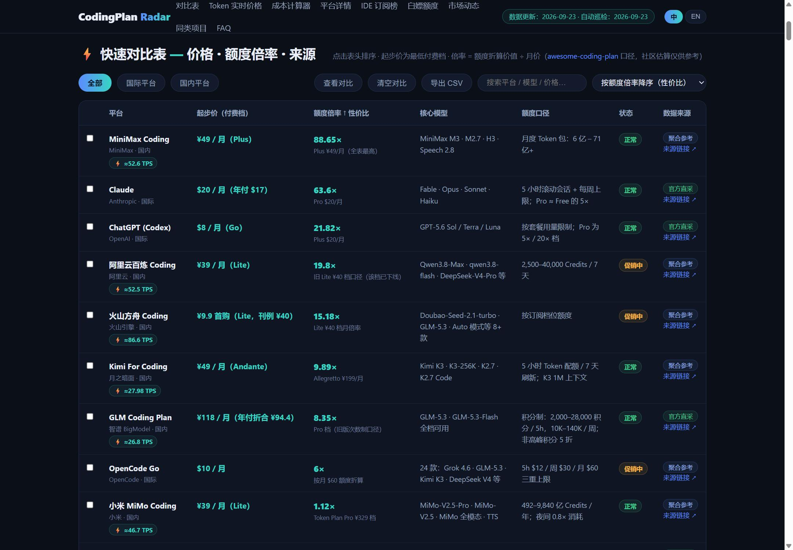
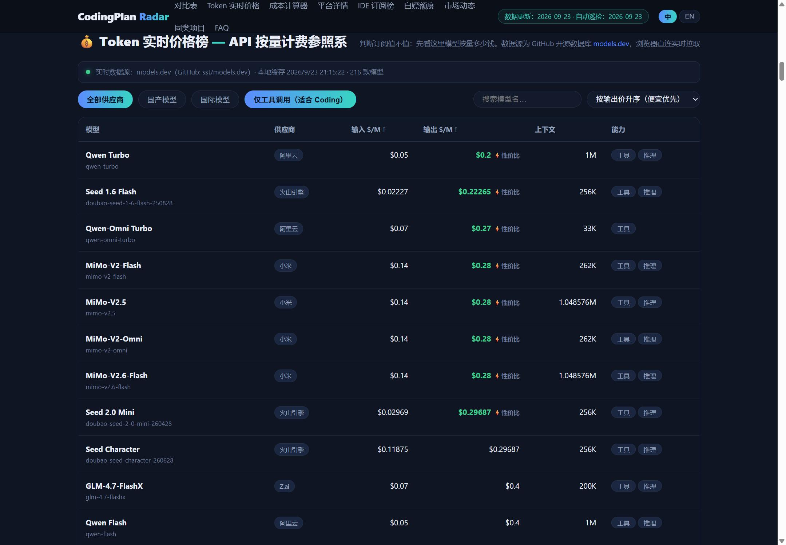
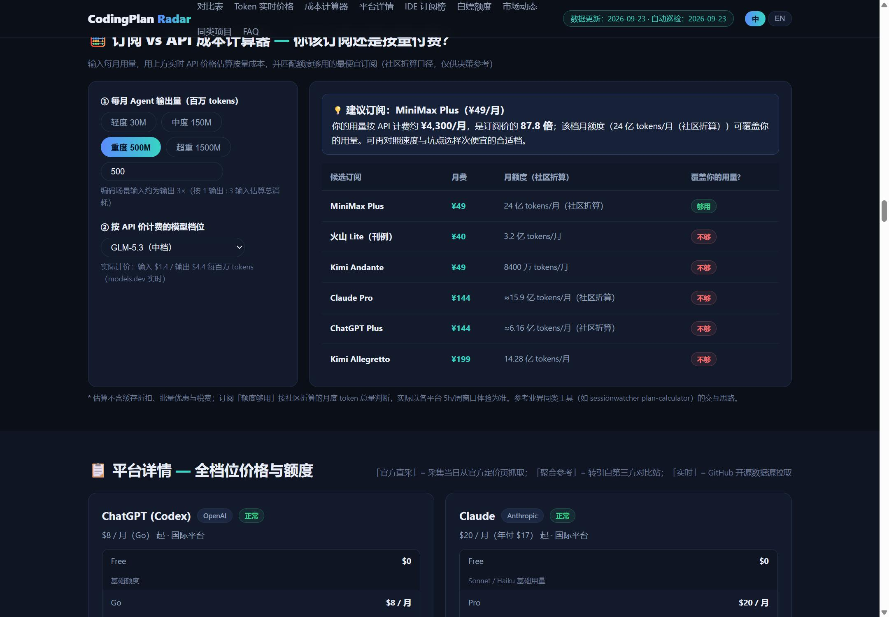
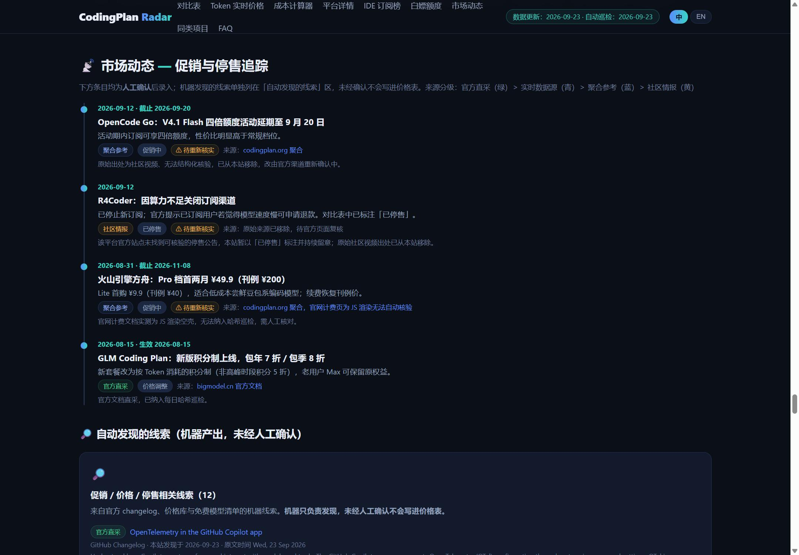

# CodingPlan Radar 📡

**AI 编程订阅计划（Coding Plan）对比站** —— 看得见数据来源的订阅指南。

[中文](#-中文) · [English](#-english) · [在线站点](https://wjf1.github.io/coding-plan-radar/) · [变更记录](CHANGELOG.md)


---

## 🇨🇳 中文

> 🔗 在线地址：**https://wjf1.github.io/coding-plan-radar/**
>
> 覆盖 **20 个平台 / 69 个付费档位**（其中国内 10 家、国际 10 家；含 1 个已停售平台作为历史记录保留），
> 每条数据标注来源与采集日期。

### ✨ 功能

| 功能 | 说明 |
|---|---|
| ⚡ 快速对比表 | 价格、额度口径、状态（正常/促销/停售），支持搜索、国内/国际筛选、多键排序 |
| ☑️ 多选对比 | 勾选 2–4 个平台生成并排对比视图，选择状态写进 URL（超出上限自动截断） |
| 📈 额度倍率 | 月度额度折算价值 ÷ 月价（[awesome-coding-plan](https://github.com/mahonzhan/awesome-coding-plan) 口径），MiniMax 88.65× / Claude 63.6× / ChatGPT 21.82× … |
| 🕒 三周期额度 | 每平台 5h / 周 / 月三档额度与倍率，识别「月倍率高但 5h 倍率低」的节奏陷阱 |
| 📉 价格历史趋势 | 每日记录起步价快照（保留 90 天），页面内以纯 SVG 迷你图呈现走势，涨价/降价自动告警 |
| 💰 Token 实时价格榜 | 浏览器直连 [models.dev](https://github.com/sst/models.dev) 拉取第一方模型 API 价（$/百万 Token），当前渲染 80 款编码模型，输出价升序 + ⚡性价比标记 |
| 🧮 订阅 vs API 计算器 | 输入月输出量与模型档位（7 档），实时估算按量成本，对比候选订阅给出「订阅还是按量」结论 |
| 🖥️ IDE 订阅榜 | 12 个 $10–20 档 IDE/编辑器订阅横评（Trae / Copilot / Zed / Kiro / Windsurf…） |
| 🎁 白嫖 / 免费额度 | 官方免费档、学生包、免费 API 额度、限时试用；标注额度 / 门槛 / 证据强度，并列出已失效的坑（如 GitHub Models 已下线） |
| 📡 市场动态 | 促销与停售追踪（人工确认）+ 自动发现的线索队列 + 信息源健康看板 + 本站变更记录 |
| 🌐 中英双语 | 页面右上角一键切换中/英：首屏与全部**结构标签**（章节标题、表格表头、工具条、计算器标签、搜索占位符）随语言切换，长文正文与导航仍为中文；语言选择随 URL 一起保留 |
| 🔗 链接可分享 | 筛选、排序、搜索词、对比选中的平台、语言全部同步到 URL，复制链接即可复现同一视图 |
| 📤 CSV 导出 | 对比表一键导出 CSV（含换行、引号的安全转义，可直接进 Excel） |
| ♿ 无障碍 | 语义化表格 + ARIA 标签（`aria-pressed` 与选中态同步）、键盘可达的「跳到主内容」链接、移动端触摸滚动 |
| 🛡️ 来源分级 | 官方直采（绿）＞ 实时数据源（青）＞ 聚合参考（蓝）＞ 社区情报（黄，仅作线索，不进价格表） |









### 🔄 每日自动更新（GitHub Actions）

仓库每天 **北京时间 09:00**（cron `0 1 * * *` UTC）自动运行 [daily-update.yml](.github/workflows/daily-update.yml)。
四个采集任务互相独立、任一失败不影响其余（`continue-on-error`），最后汇入一个 `publish` 作业：

1. **`scripts/update-snapshot.mjs`** —— 重新抓取 models.dev，重新生成 `js/snapshot.js` 兜底快照
2. **`scripts/check-pages.mjs`** —— 按 `data/sources.json` 对官方定价页/文档做内容哈希变动检测
   - 有变动 → 写入 `data/alerts.json`，站点顶部自动挂「待核实」横幅并开 issue
   - 页面回到基线哈希时**自动 resolved**；抓取失败不再静默跳过，而是计入源健康
3. **`scripts/fetch-feeds.mjs`** —— 抓取官方 changelog / 状态页 / 社区订阅源，归一化为 `data/signals.json` 线索
4. **`scripts/diff-prices.mjs`** —— 对比 models.dev / OpenRouter / LiteLLM：价格变动、免费模型增删、价格源分歧
5. **`publish` 作业**（依赖以上四项）：写入巡检日期 → `record-history.mjs` 记录价格历史快照 → 生成待人工处理清单（去重后写入 `data/reported.json`）→ 提交推送（触发 Pages 重新发布）→ 有事项时开 issue

**诚实原则**：

- 机器只负责**发现**，所有价格与促销数字一律人工确认后才进对比表；机器线索单独陈列
- 每个信息源的抓取成败写入 `data/sourcehealth.json`，在站点「市场动态 → 信息源健康」公开可见，
  **连续 3 天失败即标注「已失效」**，不再假装巡检成功
- JS 渲染的空壳页面（Qoder / CodeBuddy / 火山方舟计费页）与对机器人返回验证页的站点（OpenAI 定价页实测 403）
  明确标注为不可自动监控，不做假巡检
- **变动需二次确认**：页面内容变化要「下一次巡检仍是同一个新值」才告警（真实变动因此晚一天），
  避免动态渲染页面天天误报
- **不稳定页面自动停用预警**：cursor.com/pricing 实测两次抓取正文长度即不同（渲染变体跳变），
  连续确认后回滚达阈值即标记为「需人工核对」并停止自动告警——宁可承认监控不了，也不刷假警报

#### 处理「官方页变动」issue 的流程

1. 打开 issue 中列出的官方页面，核对新价格 / 新额度
2. 更新本地 `js/data.js` 对应平台条目（含新的采集日期）
3. 将 `data/alerts.json` 中该条目的 `"resolved": false` 改为 `true`（或等着它自动回滚解决）
4. 提交推送，横幅自动消失

#### 处理「自动发现的线索」的流程

1. 看站点「市场动态 → 自动发现的线索」，或 issue 里的线索列表
2. 人工核实后，促销/停售写进 `data/promos.json`，白嫖/免费额度写进 `data/freebies.json`
3. 社区情报（黄标）默认**不录入**，除非能追到官方出处

### 📁 目录结构

```
├── index.html              # 页面骨架（对比表 / Token 榜 / 计算器 / IDE 榜 / 白嫖 / 动态 / FAQ）
├── css/styles.css          # 全部样式（深色主题，无框架）
├── js/
│   ├── data.js             # ⭐ 订阅计划数据 + IDE 表 + 站内变更记录（日常改这里）
│   ├── app.js              # 渲染与交互逻辑（表格/卡片/计算器/实时榜/对比/CSV/多语言/价格趋势/巡检）
│   └── snapshot.js         # models.dev 兜底快照（每日自动重新生成，勿手改）
├── data/
│   ├── sources.json        # ⭐ 信息源声明清单（唯一事实来源：URL / 分级 / 关键词 / 启用状态与原因）
│   ├── promos.json         # 人工确认的促销 / 停售记录（驱动「市场动态」时间线）
│   ├── freebies.json       # 人工维护的白嫖 / 免费额度条目
│   ├── alerts.json         # 「待核实」预警状态（人工 resolved，或自动回滚解决）
│   ├── price-history.json  # 起步价每日快照（保留 90 天，自动维护，驱动价格趋势图）
│   ├── reported.json       # 已进入待处理清单的线索去重表（自动维护，避免 issue 重复列同一条）
│   ├── signals.json        # 机器发现的线索（90 天滚动窗口，自动维护）
│   ├── sourcehealth.json   # 每源抓取成败（自动维护，站点据此显示「已失效」）
│   ├── pagehash.json       # 官方页内容哈希基线（自动维护）
│   ├── pricebase.json      # 价格 / 免费模型基线（自动维护，用于差异检测）
│   └── meta.json           # 最近巡检日期（自动维护，页脚与「信息源健康」据此显示）
├── scripts/
│   ├── lib.mjs             # 公用：带 UA/超时抓取、JSON 读写、源健康、极简 RSS 解析、关键词匹配
│   ├── update-snapshot.mjs # 兜底快照
│   ├── check-pages.mjs     # 官方页哈希巡检 + 源健康
│   ├── fetch-feeds.mjs     # RSS / JSON 源 → 线索
│   ├── diff-prices.mjs     # 价格库与免费模型差异检测
│   ├── record-history.mjs  # 记录每日起步价快照（90 天滚动）+ 调价告警
│   └── publish-via-api.mjs # 走 GitHub API 发布（github.com 被阻断时替代 git push）
├── docs/screenshots/       # README 配图
└── .github/workflows/
    └── daily-update.yml    # 定时任务（cron 09:00 北京时间，可手动触发）
```

### 🚀 本地运行与部署

```bash
# 本地预览（任选其一）
python -m http.server 8765        # http://127.0.0.1:8765
npx serve .

# 数据/内容更新后发布
git add . && git commit -m "update: ..." && git push   # Pages 自动重新发布

# 若所在网络阻断了 github.com 的 HTTPS（git push 报 connection reset），改用 API 发布：
node scripts/publish-via-api.mjs "update: ..."         # 需要 GITHUB_TOKEN 或已登录的 gh CLI

# 手动跑一次完整巡检
node scripts/update-snapshot.mjs && node scripts/check-pages.mjs \
  && node scripts/fetch-feeds.mjs && node scripts/diff-prices.mjs \
  && node scripts/record-history.mjs
```

无构建步骤、零 npm 依赖（含 RSS 解析，未引入 YAML / XML 库）、纯静态 —— fork 后开启 Pages 即可获得自己的实例。

> 注：`data/sources.json` 里的社区源（LINUX DO / V2EX 等）在中国大陆线路不可达，只在 GitHub Actions
> 的海外出口能抓到；本地跑时它们会正常报失败并记录到 `sourcehealth.json`，这属预期行为。

### 📚 数据来源

| 层级 | 来源 | 用途 |
|---|---|---|
| 官方直采 | [claude.com/pricing](https://claude.com/pricing) · [docs.github.com Copilot 计划](https://docs.github.com/en/copilot/get-started/plans) · [cursor.com/pricing](https://cursor.com/pricing) · [docs.bigmodel.cn](https://docs.bigmodel.cn/cn/coding-plan/overview) · [platform.kimi.com](https://platform.kimi.com/docs/pricing) · [trae.ai](https://www.trae.ai/pricing) · [MiniMax](https://platform.minimaxi.com/document/price) · [阿里云百炼免费额度](https://help.aliyun.com/zh/model-studio/new-free-quota) · [百度智能云](https://cloud.baidu.com/) 等 | 订阅价格（人工核价）+ 每日哈希巡检 |
| 官方订阅源 | [GitHub Changelog](https://github.blog/changelog/feed/) · [Cursor Changelog](https://cursor.com/changelog/rss.xml) · [OpenAI News](https://openai.com/news/rss.xml) · [Claude](https://status.claude.com/history.rss) / [OpenAI](https://status.openai.com/history.rss) / [GitHub](https://www.githubstatus.com/history.rss) Status | 促销与可用性事件线索（RSS/Atom） |
| 实时数据源 | [models.dev](https://github.com/sst/models.dev)（API 直连，CORS 全开放）· [OpenRouter 模型表](https://openrouter.ai/api/v1/models) · [LiteLLM 价格表](https://github.com/BerriAI/litellm) | Token 价格榜 + 兜底快照 + 免费模型 / 价格差异检测 |
| 方法论 | [mahonzhan/awesome-coding-plan](https://github.com/mahonzhan/awesome-coding-plan)（2857★） | 额度倍率 / TPS / 三周期额度 / 坑点 |
| 聚合参考 | [codingplan.org](https://codingplan.org/) | 部分国内平台价格（逐条标注） |
| 社区情报 | [Hacker News](https://hn.algolia.com/) · [少数派](https://sspai.com/) · [IT之家](https://www.ithome.com/) · [awesome-free-llm-apis 提交流](https://github.com/mnfst/awesome-free-llm-apis) | 线索提示（黄色标注，**不直接进价格表**） |

> **关于 LINUX DO / V2EX（2026-09-14 结论）**：这两个一手性最强的中文社区源，经**双环境实测**均无法自动获取 ——
> 大陆线路超时，GitHub Actions 海外出口分别返回 `403 Cloudflare` 与 `HTTP 200 空响应体`。
> 这说明拦截发生在**数据中心 IP 信誉层**而非网络封锁层，**自建 VPS / RSSHub 同样解决不了**（能解决的是住宅代理）。
> 因此本站停用这两个源并改为人工巡览，不做"看起来在监控"的假象。

#### 🚫 明确不收录的信息源

| 类型 | 原因 |
|---|---|
| 逆向 / 公益 / API 中转站（free-one-api、chatanywhere 等） | 违反上游 ToS，存在密钥泄露与封号风险；且项目寿命不可预期（已有多个知名仓库 404 消失） |
| 共享账号 / 合租 | 账号安全与平台条款风险 |
| 需登录 cookie 抓取（小红书 / 即刻 / 公众号中转） | 合规与稳定性均不可接受 |
| X / Twitter、36氪 / 机器之心原生 RSS | 前者路由需多组鉴权 token 且官方实例已关闭，后者实测返回反爬页或非 feed |
| 中文羊毛聚合站（福利吧 / hostloc / 什么值得买首页） | 实测主动断连 / 需邀请码 / 与 AI 订阅无关内容为主，噪声比极差 |
| LINUX DO / V2EX（暂缓） | 双环境实测均不可自动获取（403 Cloudflare / 空响应体），属数据中心 IP 信誉拦截，自建 VPS 无效；保留配置但 `enabled: false`，有住宅代理时可一键启用 |

> **LiteLLM 只做参考基线，不告警**：按模型名匹配会把不同 SKU 配到一起（如 litellm 的 `azure/gpt-5.6`
> 转售价 $30 vs 第一方 `openai/gpt-5.6` $20），首个真实 CI 运行即产生 146 条假"价格分歧"信号。
> 因此它只抓取、只记录基线供人工比对，不再自动报警。

> 2026-09-14：原「B站每日播报」来源已移除。相关条目的原始出处仅剩视频、无法结构化核验，
> 故改由上述官方 / 结构化源持续找官方确认；未能复核的条目在站点上明确标注「⚠ 待重新核实」。

#### ⚖️ 免责声明

- 价格与额度可能随时变化，**付款前务必以平台官网为准**
- 「额度倍率」「编辑推荐」为基于公开数据的社区口径估算与主观参考，非官方承诺，非广告
- 免费额度条目的领取条件与规则以官方为准，本站仅做汇总与出处标注
- 本站不含任何推广链接，与所列平台无商业关系；所有商标归各自所有者

---

## 🇬🇧 English

**A comparison site for AI coding subscription plans (Coding Plan) — a subscription guide where you can see where every number comes from.**

> 🔗 Live: **https://wjf1.github.io/coding-plan-radar/**
>
> Covers **20 platforms / 69 paid tiers** (10 China-region, 10 international, plus 1 discontinued platform kept as a historical record).
> Every data point is annotated with its source and collection date.

### ✨ Features

| Feature | Description |
|---|---|
| ⚡ Quick comparison table | Price, quota definition, status (active / promo / discontinued); search, China vs. international filter, multi-key sorting |
| ☑️ Multi-select comparison | Tick 2–4 platforms to build a side-by-side comparison view; the selection is stored in the URL (extra entries are truncated) |
| 📈 Quota ratio | Monthly quota value ÷ monthly price, using the [awesome-coding-plan](https://github.com/mahonzhan/awesome-coding-plan) methodology — MiniMax 88.65× / Claude 63.6× / ChatGPT 21.82× … |
| 🕒 Three-period quotas | Per-platform 5h / weekly / monthly quota and ratios, to expose the "high monthly ratio but low 5h ratio" pacing trap |
| 📉 Price history trend | Daily starting-price snapshots (90-day retention) rendered as inline SVG sparklines, with automatic up/down price-change alerts |
| 💰 Live Token price board | Fetched directly in the browser from [models.dev](https://github.com/sst/models.dev) ($/million tokens); currently renders 80 coding models, sorted by output price with a ⚡ value flag |
| 🧮 Subscription vs. API calculator | Enter monthly output volume and an API model tier (7 tiers) to estimate pay-as-you-go cost and decide "subscribe or pay per token" |
| 🖥️ IDE subscription board | 12 IDE/editor subscriptions in the $10–20 band (Trae / Copilot / Zed / Kiro / Windsurf…) |
| 🎁 Free tiers & freebies | Official free tiers, student packs, free API quotas, limited-time trials — each with quota / eligibility / evidence strength, plus retired offers (e.g. GitHub Models is gone) |
| 📡 Market dynamics | Promo and discontinuation tracking (human-confirmed) + an auto-discovered lead queue + a source-health dashboard + site changelog |
| 🌐 Bilingual UI | One-click Chinese / English switch in the header: the hero and all **structural labels** (section titles, table headers, toolbars, calculator labels, search placeholders) follow the language; long-form prose and the nav stay Chinese. The choice persists in the URL |
| 🔗 Shareable links | Filters, sorting, search terms, compared platforms and language all sync to the URL — copy the link to reproduce the exact view |
| 📤 CSV export | One-click CSV export of the comparison table (safe escaping of newlines and quotes, Excel-ready) |
| ♿ Accessibility | Semantic tables with ARIA labels (`aria-pressed` kept in sync with selection state), a keyboard-reachable "skip to content" link, touch scrolling on mobile |
| 🛡️ Source tiers | Official direct (green) > real-time data source (cyan) > aggregated reference (blue) > community intel (yellow, leads only — never enters the price table) |

### 🔄 Daily automated updates (GitHub Actions)

Every day at **09:00 Beijing time** (cron `0 1 * * *` UTC) the repo runs [daily-update.yml](.github/workflows/daily-update.yml).
Four collection jobs run independently — one failing does not affect the others (`continue-on-error`) — then a `publish` job ties them together:

1. **`scripts/update-snapshot.mjs`** — refetch models.dev and regenerate the `js/snapshot.js` fallback snapshot
2. **`scripts/check-pages.mjs`** — content-hash change detection on official pricing/documentation pages, driven by `data/sources.json`
   - On change → write to `data/alerts.json`, show a "pending verification" banner on the site and open an issue
   - Auto-resolves when a page returns to its baseline hash; fetch failures are no longer silently skipped — they count against source health
3. **`scripts/fetch-feeds.mjs`** — fetch official changelogs / status pages / community feeds and normalize them into leads in `data/signals.json`
4. **`scripts/diff-prices.mjs`** — compare models.dev / OpenRouter / LiteLLM: price moves, free-model additions and removals, disagreements between price sources
5. **`publish` job** (depends on the four above): write the inspection date → record price-history snapshots via `record-history.mjs` → build the human review list (deduplicated into `data/reported.json`) → commit and push (triggers a Pages redeploy) → open an issue when there is something to review

**Honesty principles**

- Machines only **discover**; every price and promo number is human-confirmed before it enters the comparison table. Machine leads are listed separately.
- Per-source fetch success/failure is written to `data/sourcehealth.json` and shown publicly under "Market dynamics → Source health". **Three consecutive days of failure marks a source as dead** — no pretending the inspection succeeded.
- JavaScript-only shell pages (Qoder / CodeBuddy / 火山方舟 billing pages) and sites that serve a challenge page to bots (OpenAI's pricing page returns 403) are explicitly labelled as not monitorable — no fake monitoring.
- **Changes require double confirmation**: a changed page must still show the same new value on the next run before it alerts (so a real change is reported one day late). This prevents dynamic pages from generating false alarms every day.
- **Unstable pages are automatically dropped from alerting**: cursor.com/pricing returns a different body length on two consecutive fetches (rendering variants jump around). Once confirmed, it is marked "needs manual review" and alerting stops — better to admit a page cannot be monitored than to spam false alarms.

#### Handling a "official page changed" issue

1. Open the official page listed in the issue and verify the new price / quota
2. Update the matching platform entry in `js/data.js` (including a new collection date)
3. Set `"resolved": false` to `true` in `data/alerts.json` for that entry (or wait for the automatic rollback to resolve it)
4. Commit and push — the banner disappears

#### Handling "auto-discovered leads"

1. Look at "Market dynamics → Auto-discovered leads" on the site, or the lead list in the issue
2. After verifying by hand, write promos/discontinuations into `data/promos.json` and freebies into `data/freebies.json`
3. Community intel (yellow) is **not** entered by default unless an official source can be traced

### 📁 Repository layout

```
├── index.html              # Page skeleton (comparison table / token board / calculator / IDE board / freebies / dynamics / FAQ)
├── css/styles.css          # All styling (dark theme, no framework)
├── js/
│   ├── data.js             # ⭐ Subscription plan data + IDE table + in-site changelog (edit this day to day)
│   ├── app.js              # Rendering and interaction (tables/cards/calculator/live board/compare/CSV/i18n/price trend/inspection)
│   └── snapshot.js         # models.dev fallback snapshot (regenerated daily — do not edit by hand)
├── data/
│   ├── sources.json        # ⭐ Source manifest (single source of truth: URLs / tiers / keywords / enabled state and reasons)
│   ├── promos.json         # Human-confirmed promos and discontinuations (drives the "market dynamics" timeline)
│   ├── freebies.json       # Human-maintained free-tier / freebie entries
│   ├── alerts.json         # "Pending verification" alert state (resolved by hand, or by automatic rollback)
│   ├── price-history.json  # Daily starting-price snapshots (90-day retention, auto-maintained, drives the price trend chart)
│   ├── reported.json       # Dedup table of leads already surfaced for review (auto-maintained, keeps issues from repeating)
│   ├── signals.json        # Machine-discovered leads (90-day rolling window, auto-maintained)
│   ├── sourcehealth.json   # Per-source fetch success/failure (auto-maintained; drives the "dead" badge)
│   ├── pagehash.json       # Official page content-hash baselines (auto-maintained)
│   ├── pricebase.json      # Price / free-model baselines (auto-maintained, used for diffing)
│   └── meta.json           # Last inspection date (auto-maintained; shown in the footer and "source health")
├── scripts/
│   ├── lib.mjs             # Shared helpers: fetch with UA/timeout, JSON IO, source health, minimal RSS parser, keyword matching
│   ├── update-snapshot.mjs # Fallback snapshot
│   ├── check-pages.mjs     # Official page hash inspection + source health
│   ├── fetch-feeds.mjs     # RSS / JSON sources -> leads
│   ├── diff-prices.mjs     # Price-base and free-model diffing
│   ├── record-history.mjs  # Record daily starting-price snapshots (90-day rolling) + price-change alerts
│   └── publish-via-api.mjs # Publish through the GitHub API (fallback when github.com is blocked)
├── docs/screenshots/       # README images
└── .github/workflows/
    └── daily-update.yml    # Scheduled job (cron 09:00 Beijing time, manually triggerable)
```

### 🚀 Running and deploying locally

```bash
# Local preview (pick one)
python -m http.server 8765        # http://127.0.0.1:8765
npx serve .

# Publishing after data/content changes
git add . && git commit -m "update: ..." && git push   # Pages redeploys automatically

# If your network blocks github.com over HTTPS (git push reports connection reset), publish via the API:
node scripts/publish-via-api.mjs "update: ..."         # needs GITHUB_TOKEN or a logged-in gh CLI

# Run one full inspection by hand
node scripts/update-snapshot.mjs && node scripts/check-pages.mjs \
  && node scripts/fetch-feeds.mjs && node scripts/diff-prices.mjs \
  && node scripts/record-history.mjs
```

No build step, zero npm dependencies (including the RSS parser — no YAML/XML library), purely static — fork it, enable Pages, and you have your own instance.

> Note: the community sources in `data/sources.json` (LINUX DO / V2EX and friends) are unreachable from mainland
> China routes and can only be fetched from GitHub Actions' overseas egress. Running locally, they will report
> failure and be recorded in `sourcehealth.json` — that is expected behaviour.

### 📚 Data sources

| Tier | Source | Used for |
|---|---|---|
| Official direct | [claude.com/pricing](https://claude.com/pricing) · [docs.github.com Copilot plans](https://docs.github.com/en/copilot/get-started/plans) · [cursor.com/pricing](https://cursor.com/pricing) · [docs.bigmodel.cn](https://docs.bigmodel.cn/cn/coding-plan/overview) · [platform.kimi.com](https://platform.kimi.com/docs/pricing) · [trae.ai](https://www.trae.ai/pricing) · [MiniMax](https://platform.minimaxi.com/document/price) · [Alibaba Cloud Model Studio free quota](https://help.aliyun.com/zh/model-studio/new-free-quota) · [Baidu AI Cloud](https://cloud.baidu.com/) etc. | Subscription prices (human-verified) + daily hash inspection |
| Official feeds | [GitHub Changelog](https://github.blog/changelog/feed/) · [Cursor Changelog](https://cursor.com/changelog/rss.xml) · [OpenAI News](https://openai.com/news/rss.xml) · [Claude](https://status.claude.com/history.rss) / [OpenAI](https://status.openai.com/history.rss) / [GitHub](https://www.githubstatus.com/history.rss) status | Promo and availability event leads (RSS/Atom) |
| Real-time sources | [models.dev](https://github.com/sst/models.dev) (direct API, CORS fully open) · [OpenRouter models](https://openrouter.ai/api/v1/models) · [LiteLLM price table](https://github.com/BerriAI/litellm) | Token price board + fallback snapshot + free-model / price diffing |
| Methodology | [mahonzhan/awesome-coding-plan](https://github.com/mahonzhan/awesome-coding-plan) (2,857★) | Quota ratios / TPS / three-period quotas / pitfalls |
| Aggregated reference | [codingplan.org](https://codingplan.org/) | Some China-region platform prices (annotated per entry) |
| Community intel | [Hacker News](https://hn.algolia.com/) · [sspai](https://sspai.com/) · [IT之家](https://www.ithome.com/) · [awesome-free-llm-apis submissions](https://github.com/mnfst/awesome-free-llm-apis) | Lead hints (yellow labels, **never enter the price table directly**) |

> **On LINUX DO / V2EX (conclusion, 2026-09-14)**: the two strongest first-hand Chinese community sources cannot be
> fetched automatically in **either** environment — mainland routes time out, while GitHub Actions' overseas egress
> gets `403 Cloudflare` and `HTTP 200 with an empty body` respectively. The block therefore happens at the
> **datacenter IP reputation layer**, not the network-blocking layer, so a self-hosted VPS or RSSHub **cannot fix it**
> (a residential proxy can). The site therefore disables both sources and falls back to manual browsing, rather than
> putting on a show of monitoring them.

#### 🚫 Sources deliberately excluded

| Type | Reason |
|---|---|
| Reverse-engineered / public-good / API relay services (free-one-api, chatanywhere, etc.) | Violate upstream ToS, with key-leak and ban risks; project lifespan is unpredictable (several well-known repos have 404'd) |
| Shared or co-rented accounts | Account security and platform ToS risk |
| Sources requiring login cookies (Xiaohongshu / Jike / WeChat relay) | Neither compliance nor reliability is acceptable |
| X / Twitter, 36Kr / Synced native RSS | The former needs multiple auth tokens and its official instance is shut; the latter returns anti-bot pages or non-feeds |
| Chinese deal aggregators (福利吧 / hostloc / SMZDM homepage) | Measured active disconnects / invite-only / mostly content unrelated to AI subscriptions — a terrible signal-to-noise ratio |
| LINUX DO / V2EX (deferred) | Neither environment can fetch them (403 Cloudflare / empty body); it is datacenter-IP reputation blocking, so a VPS does not help. Configuration is kept with `enabled: false` so a residential proxy can switch it on in one line |

> **LiteLLM is a reference baseline only, never alerted on**: matching by model name pairs up different SKUs
> (e.g. litellm's `azure/gpt-5.6` resale at $30 vs. first-party `openai/gpt-5.6` at $20). The very first real CI run
> produced 146 false "price disagreement" signals. It is therefore fetched and recorded as a baseline for human
> comparison, but no longer alerts automatically.

> 2026-09-14: the original "daily Bilibili roundup" source was removed. Those entries only existed as video with no
> structured way to verify them, so confirmation now relies on the official/structured sources above. Entries that
> could not be re-verified are explicitly marked "⚠ pending re-verification" on the site.

#### ⚖️ Disclaimer

- Prices and quotas can change at any time — **always confirm on the vendor's own site before paying**
- "Quota ratio" and "editor's picks" are community-methodology estimates and subjective references based on public data — not official promises, not advertising
- Eligibility and rules for free tiers are governed by the vendors; this site only aggregates them and cites sources
- This site contains no affiliate links and has no commercial relationship with the platforms listed; all trademarks belong to their respective owners

---

📝 **变更记录 / Changelog**：[CHANGELOG.md](CHANGELOG.md)
